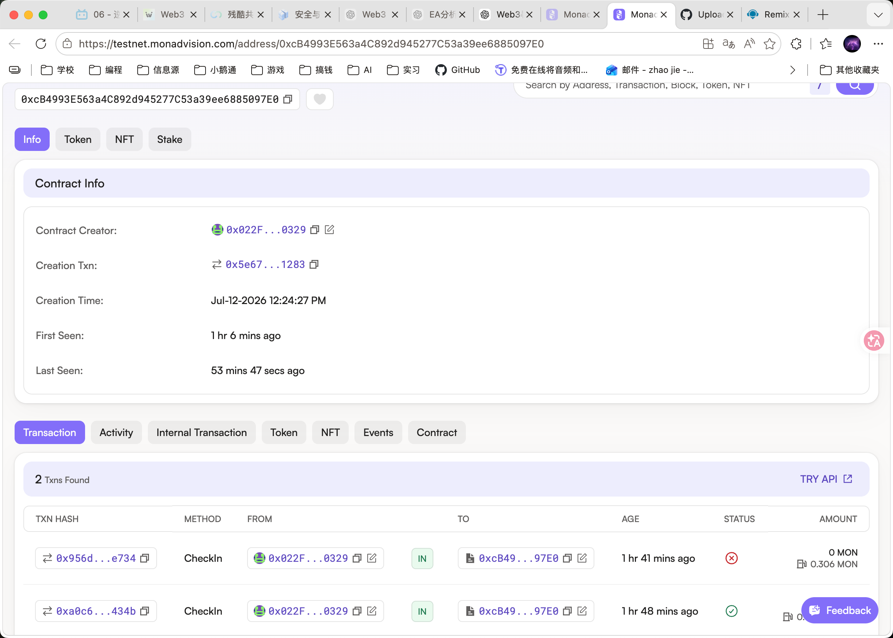
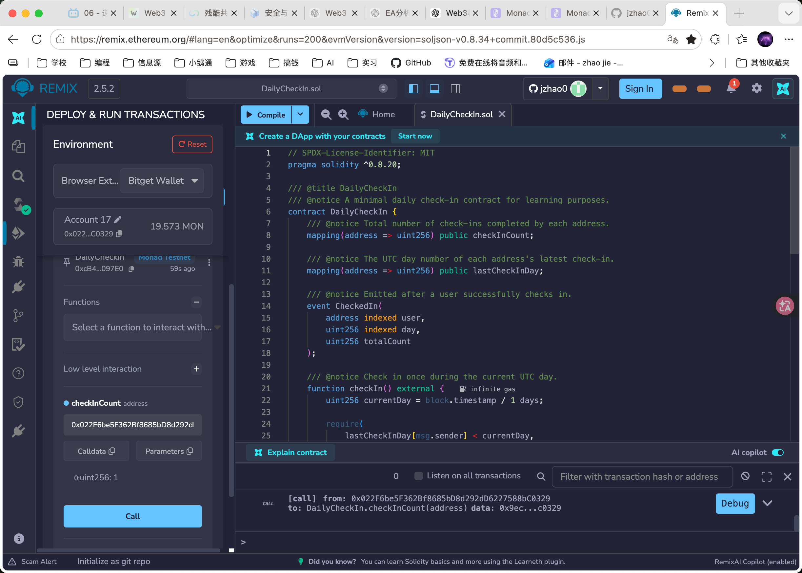

# DailyCheckIn

> README Version: v0.1

## 项目简介

DailyCheckIn 是一个部署在 Monad Testnet 上的最小每日打卡智能合约。

每个钱包地址在每个 UTC 自然日最多可以打卡一次。合约会记录每个地址的累计打卡次数，以及最后一次打卡对应的 UTC 日期编号。

本项目用于学习以下完整流程：

- 使用 AI 生成 Solidity 合约初稿
- 对 AI 代码进行人工检查和修改
- 在 Remix 中编译合约
- 使用课程专用钱包连接 Monad Testnet
- 部署智能合约
- 调用 read / write function
- 在区块浏览器中验证交易

## 合约功能

### `checkIn()`

执行每日打卡。

该函数会：

1. 计算当前 UTC 日期编号。
2. 检查调用地址当天是否已经打卡。
3. 更新最后一次打卡日期。
4. 将累计打卡次数加一。
5. 触发 `CheckedIn` 事件。

这是 write function，需要钱包签名、支付测试网 Gas，并产生 Transaction Hash。

### `canCheckIn(address user)`

查询指定钱包地址今天是否可以打卡。

- `true`：今天可以打卡
- `false`：今天已经打卡

这是 read function，不修改链上状态。

### `checkInCount(address user)`

查询指定钱包地址的累计打卡次数。

### `lastCheckInDay(address user)`

查询指定钱包地址最后一次打卡对应的 UTC 日期编号。

## 技术信息

- Contract Name: `DailyCheckIn`
- Solidity Version: `^0.8.20`
- Network: Monad Testnet
- Chain ID: `10143`
- License: MIT
## 链上部署信息

- Contract Name: `DailyCheckIn`
- Network: `Monad Testnet`
- Chain ID: `10143`
- Deployer Address: `0x022F6be5F362Bf8685bD8d292dD6227588bC0329`
- Contract Address: `0xcB4993E563a4C892d945277C53a39ee6885097E0`
- Deployment Transaction Hash: `0x5e67f389ed93417a37fd9cad1ab5e4e85353238b9efe1a3f244284dfee6c1283`
- Write Function: `checkIn()`
- Successful CheckIn Transaction Hash: `0xa0c653fee6a368a38bda43e1e02bf79f6e9117ac726e3e456fffe2488d74434b`
- Transaction Status: `Success`
## 部署步骤

1. 在 Remix 中创建 `DailyCheckIn.sol`。
2. 粘贴 Solidity 合约源码。
3. 使用 Solidity 0.8.x 编译器完成编译。
4. 打开 `Deploy & Run Transactions`。
5. 选择 `Browser Extension` 并连接 Bitget Wallet。
6. 将钱包切换到 Monad Testnet。
7. 确认 Chain ID 为 `10143`。
8. 确认钱包中有测试 MON。
9. 点击 `Deploy`。
10. 在钱包中确认部署交易。
11. 在 MonadVision 中查询部署结果。

## 合约交互

### Write Function

在 Remix 的 `Deployed Contracts` 中展开合约，调用：
```text
checkIn()
```

## Demo 截图
### MonadVision 合约部署与交互记录



### Remix Read Function 查询结果


